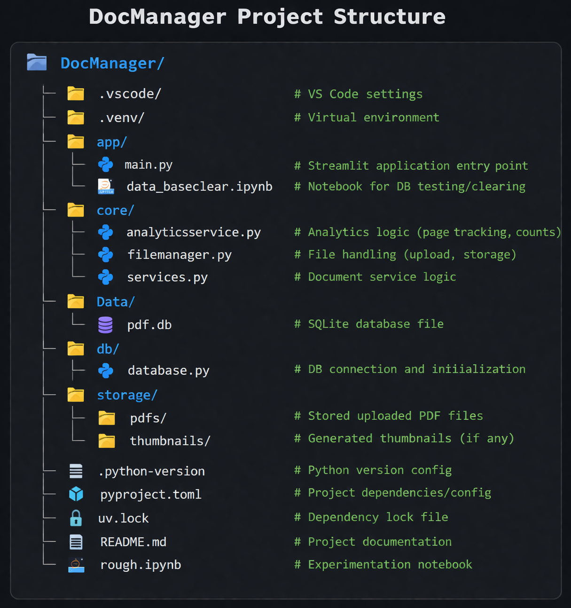

📄 Document Manager with Analytics
A simple yet structured Document Management System built using Streamlit and SQLite, designed to upload, manage, and analyze document usage.

🚀 Overview
This project allows users to:
Upload and manage documents
Track page-level interactions
Analyze document usage through basic analytics
It is built with a focus on clean architecture principles, separating UI, business logic, and database layers.

## 🏗️ Project Structure

🧠 Key Features
📂 Upload and store documents
🗃️ Persistent storage using SQLite
📊 Track page visits per document
🔍 Count unique pages viewed
🖥️ Interactive UI with Streamlit

⚙️ Tech Stack
Python
Streamlit – UI framework
SQLite – Lightweight database

🤝 Contribution
This is a learning project, but suggestions and improvements are always welcome!